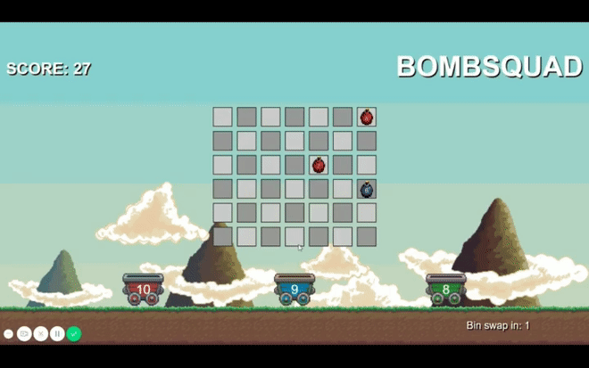

# bombsquad

A minigame made using Vue.js. 

[Play It Here](https://haydenbbickerton.github.io/bombsquad/)

- Bombs pop up on the board
- Drag them to their bucket at the bottom, according to the color of the bomb/bucket

- There are 3 colored bins at the bottom, they swap positions every 40 seconds
- Bombs will pop up on the game board, drag them to their same-colored bin before explosion
- The amount of bombs increases, filling the board quickly
- After 120 bombs, they stop popping up
- Your score is the amount of bombs you put in the bins before they explode




To build it yourself:

```bash
$ yarn install
```

To run:

```bash
$ npm run dev
```

And open [localhost:4000](http://localhost:4000) in your browser
